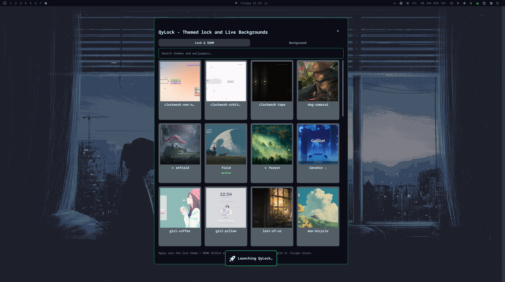

# QyLock — Themed lock and Live Backgrounds for Omarchy

An [Omarchy](https://omarchy.org/) shell plugin that gives you an interface for using custom Lock and SDDM Themes, Setting Backgrounds and experimental video backgrounds.

## Install (from git)

Requires `git` (present on Omarchy by default; `omarchy pkg add git` if not):

```sh
# 1. add the plugin from GitHub
omarchy plugin add https://github.com/mjtiempo/qylock-oma.git --enable --yes

#    — or via SSH (mjtiempo key):
#    omarchy plugin add git@github.com:mjtiempo/qylock-oma.git --enable --yes

# 2. restart the shell to load it
omarchy restart shell
```

You can select and set Lock and SDDM Theme. You can also change backgrounds. Both bundled backgrounds and system backgrounds shipped in Omarchy are listed in the picker. Also included is an experimental support for video backgrounds. Users can add custom image/video backgrounds by dropping backgrounds in `~/Pictures/Backgrounds/`



### On first load the plugin

1. **Synchronises the theme catalog** (list + previews, ~3 MB) and prepares a
   light asset cache (lock app + safe fallback theme) — total footprint
   **~10 MB**. The heavy theme media is fetched later, per theme, only when
   you Apply or Preview it (first use of a theme needs network and takes a
   moment; afterwards it's instant).
2. **Registers launcher entries** (see below) — no manual config.

If a theme's assets aren't fetched yet, Preview/Apply fetch them on demand —
you can also prefetch with `omarchy-shell mark.lock-themes fetchTheme <name>`.

Validate the folder at any time:

```sh
omarchy plugin validate ~/.config/omarchy/plugins/mark.lock-themes
qmllint -I "$OMARCHY_PATH/shell" \
  ~/.config/omarchy/plugins/mark.lock-themes/Service.qml \
  ~/.config/omarchy/plugins/mark.lock-themes/Menu.qml
```

### Update

```sh
omarchy plugin update mark.lock-themes
omarchy restart shell
```

## Launcher entries (automatic)

On first load the plugin registers itself, so installing users need to do
nothing manual:

- **Omarchy menu row** — a `QyLock` entry under the **Style** section
  (searchable: `qylock`, `lock`, `sddm`, `theme`) is added to
  `~/.config/omarchy/extensions/omarchy-menu.jsonc` (only if the key is
  missing; existing entries are untouched; a legacy root-level entry from
  older versions is migrated automatically). It summons the picker.
- **Desktop entry** — `~/.local/share/applications/qylock-oma.desktop` makes
  it appear in the launcher/Apps search, with the plugin's `preview.png` as
  its icon.

Both are written at user level, idempotently, at every shell start. Disable
with `"autoEntries": false` in the plugin's `shell.json` entry.

## Usage

Open the picker (`omarchy menu` → search **qylock**, or launch **QyLock**
from the app launcher; bind it, e.g. `SUPER+SHIFT+L`):

```sh
omarchy-shell shell summon mark.lock-themes '{}'
```

The picker is a square theme grid with two tabs:

- **Lock & SDDM** — click a theme card to select it; **Preview** and **Apply**
  buttons appear on the card. **Preview** locks now with that theme (without
  changing your selection); **Apply** sets both the lock theme and the SDDM
  login theme (a "Password required to Apply SDDM theme" prompt for the
  SDDM part — afterwards SDDM applies are remembered).
- **⚙ Lock provider** (top-right of the picker) — switches to the native
  Omarchy lock. The themed lock is the default: applying a lock theme (or
  setting one from the CLI) switches back to it automatically, and a crash
  that breaks the themed lock restores native on its own. Only switching
  to native is a manual choice.

The **search box** above the grid filters by name as you type (both tabs;
`Escape` or ✕ clears it).

- **Background** — click a card, then **Apply** to use its artwork as the
  Omarchy background (lock screen + wallpaper).

The currently applied theme carries a small green **applied** badge (no
selection highlight); the selected card is highlighted green with its action
buttons. A scrollbar on the right scrolls the grid (drag or click);
`Escape` closes.

Everything can also be driven from the command line:

```sh
omarchy-shell mark.lock-themes sync                # download/update themes
omarchy-shell mark.lock-themes status              # JSON status
omarchy-shell mark.lock-themes themes              # JSON theme list
omarchy-shell mark.lock-themes applyBoth material-you   # lock + SDDM
omarchy-shell mark.lock-themes previewLock clockwork-orbital  # lock now
omarchy-shell mark.lock-themes applyBackground forest      # background only
omarchy-shell mark.lock-themes fetchTheme nier-automata     # prefetch assets
```

## Animated backgrounds

The Background tab can play **live wallpapers**, not just static images:

- **Video themes** (backgrounds ending in `.mp4`/`.webm`/`.mkv`/`.mov` — the
  cards carry a small ▶ video badge) loop on the Omarchy wallpaper, muted and
  cropped to fill.
- **GIF/APNG** files set with `omarchy theme bg set <file>` also animate.

Playing video/GIF wallpapers needs a background renderer that can display
media — **this plugin ships one** (`background/Background.qml`). It takes
over the `background` IPC target automatically: the plugin disables
Omarchy's static `omarchy.background` renderer at start (one live handler
per target — a second one would corrupt Quickshell's IPC registry), and
the built-in renderer answers background ops from then on. Re-enable
`omarchy.background` (`omarchy-shell shell setPluginEnabled omarchy.background
true`) to restore the stock renderer; videos then no longer animate (the
plugin will re-disable it on the next start).

### Built-in Omarchy wallpapers

The Background tab also lists every wallpaper Omarchy ships plus your own,
scanned from the same folders the built-in background switcher
(`omarchy background`) uses:

- `/usr/share/omarchy/themes/*/backgrounds/` — each installed theme's
  wallpaper set, listed as `<theme>-<file>` (e.g. `gruvbox-5-leaves`)
- `~/Pictures/Backgrounds/` — **drop-in folder**: put any image here and
  it appears in the picker within ~30 seconds (no restart); GIFs/APNGs and
  videos animate too. The folder is created automatically.
- `~/.config/omarchy/backgrounds/` — the custom folder omarchy's own
  switcher uses (listed by file name)

They appear **only in the Background tab** (they are not lock/SDDM themes)
and apply like any theme (click, Apply). A `backgroundDirs` array in the
plugin's `shell.json`/`config.json` entry replaces the default folders with
your own list of absolute paths.

Notes:

- The service verifies the background state link **and** the artwork file
  after applying — a video that fails to *render* still exits `0` in the
  setter, so rendering health is an artifact of the renderer, not this
  plugin.
- Battery/heat: a permanently repainting fullscreen surface costs power.
  The renderer pauses when the session locks and resumes on unlock; hardware
  decode (VA-API) is used when available, but expect a measurable delta vs. a
  static background.
- The lock screen itself always plays the theme's own video (the repo lock
  app handles it); this feature covers the **desktop wallpaper**.

## Lock behavior

The picker's themes are rendered by the repository's Quickshell lock app,
which answers the `lock` IPC target: locking (keybinding, idle timer,
suspend — `omarchy system lock`) shows the selected theme's lock screen with
the repo's design. The native Omarchy lock plugin is disabled while the
plugin is active (password unlock only — no fingerprint).

To restore the native Omarchy lock: open the picker, hit **⚙** (top-right)
and choose **Use native lock** — one action, persisted (your themes stay
installed). The equivalent CLI path re-enables the native plugin and
persists to `config.json` (whose `lockMode` field wins over `shell.json`):

```sh
omarchy-shell mark.lock-themes setLockMode native
omarchy-shell shell setPluginEnabled dumidu.orbital-lock true
omarchy restart shell
```

Offline variant: add `"lockMode": "native"` to the plugin's `shell.json`
entry and remove `~/.local/state/omarchy/mark.lock-themes/config.json`
(an auto-persisted `lockMode: "themed"` there would win), then restart the
shell.

The installed lock app gets a small compatibility shim injected at install
time (an inert `keyboard` object + `sddm.hostName`) so themes that use SDDM's
keyboard context or gate login on `isQuickshell` behave correctly.

### Emergency manual recovery

If you ever end up on a black screen while locked:

1. Switch to a TTY (`Ctrl+Alt+F3`), log in.
2. Release the stranded lock — either from your desktop session:
   `~/.config/omarchy/plugins/mark.lock-themes/tools/release-session-lock.sh`
   or from the TTY with the session env:
   `XDG_RUNTIME_DIR=/run/user/1000 WAYLAND_DISPLAY=wayland-0`
   `~/.config/omarchy/plugins/mark.lock-themes/tools/release-session-lock.sh`
   (runs the session-lock protocol's unlock cycle).
3. `loginctl unlock-session 2` (the wayland session; check
   `loginctl list-sessions`).
4. `pkill -f lock_shell.qml` to drop any hung lock client.
5. Switch back with `Ctrl+Alt+F1`.

The plugin itself runs steps 2-3 automatically when the lock app dies.

## Configure

Optional `shell.json` plugin entry (defaults shown):

```json
{
  "id": "mark.lock-themes",
  "repo": "https://github.com/Darkkal44/qylock.git",
  "catalogRepo": "https://github.com/mjtiempo/qylock-oma-catalog.git",
  "branch": "",
  "lockThemeFile": "~/.config/qylock/theme",
  "lockAppSubdir": "quickshell-lockscreen",
  "autoSync": true,
  "autoEntries": true
}
```

The repository URL/branch is configured through the `shell.json` plugin entry
(or `~/.local/state/omarchy/mark.lock-themes/config.json`, which wins over
`shell.json`). Sync happens automatically on start and can be triggered with
`omarchy-shell mark.lock-themes sync`. The theme list is the catalog's
`index.json` — each entry's `subpath` addresses `themes/<subpath>/` in the
theme repo, fetched on demand (to add a theme, extend the catalog repo).
State and downloaded themes live under:

- `~/.local/share/omarchy/mark.lock-themes/` — repo clone, installed lock app
- `~/.local/state/omarchy/mark.lock-themes/` — status.json, themes.json, state
- `/etc/sddm.conf.d/theme.conf.bak.*` — backups taken before SDDM switches

## Architecture (catalog + lazy assets)

The plugin keeps the initial footprint small by splitting the data:

- **Catalog repo** — [mjtiempo/qylock-oma-catalog](https://github.com/mjtiempo/qylock-oma-catalog)
  (public, GPLv3): `index.json` (the theme list + flags) and small preview
  PNGs (~3 MB). This is what fills the grid, so the picker opens instantly.
- **Lazy asset cache** — `~/.local/share/omarchy/mark.lock-themes/assets/` is
  a **blobless sparse clone** of the upstream qylock repo. Only
  `quickshell-lockscreen` and the safe fallback theme (`girl-coffee`) are
  materialized up front; each theme's files are fetched on demand when you
  Apply, Preview, or prefetch:

  ```sh
  omarchy-shell mark.lock-themes fetchTheme forest   # ~53 MB for forest
  ```

  Unused themes cost a few KB (tree metadata only), so the cache holds ~10 MB
  before any fetches and grows only with the themes you actually use
  (previously the whole repo was cloned up front: ~1.6 GB).

## How it works

- `Service.qml` (service kind, `keepLoaded`) owns the work: catalog sync with
  `Quickshell.Io.Process`, the sparse per-theme asset fetches, the privileged
  SDDM install via `pkexec` (prompted by the shell's own Polkit agent), and
  the lock app + theme preference writes. It exposes an `IpcHandler` under
  `mark.lock-themes` and mirrors state to `status.json` / `themes.json`.
- `Menu.qml` (menu kind) is a layer-shell surface that watches those files
  and sends requests through `request.json`.

## Attribution

Themes and the Quickshell lock app come from
[Darkkal44/qylock](https://github.com/Darkkal44/qylock) — the SDDM/lock theme
sets (`themes/<name>/`) and its lock app (`quickshell-lockscreen/`) — and are
downloaded at runtime, not redistributed by this plugin. The clockwork
family's orbital style follows
[dumidulkdev/omarchy-orbital-lock](https://github.com/dumidulkdev/omarchy-orbital-lock)
by **Dumidul**.

Fonts, artwork and theme designs are the property of their respective
creators; several themes need a font that cannot be bundled (see qylock's
README "Font Requirements" table — e.g. Genshin, NieR, Terraria, Minecraft).

**License** — plugin code is **MIT** (see LICENSE). Downloaded themes and
lock app are **GPLv3**, © Darkkal44. Redistributing this plugin together
with downloaded theme content makes the combined distribution subject to
the themes' GPLv3 terms.
